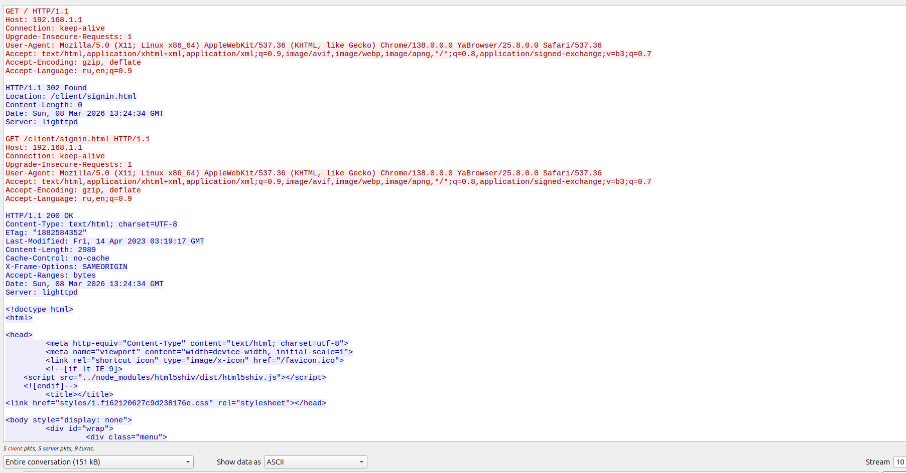
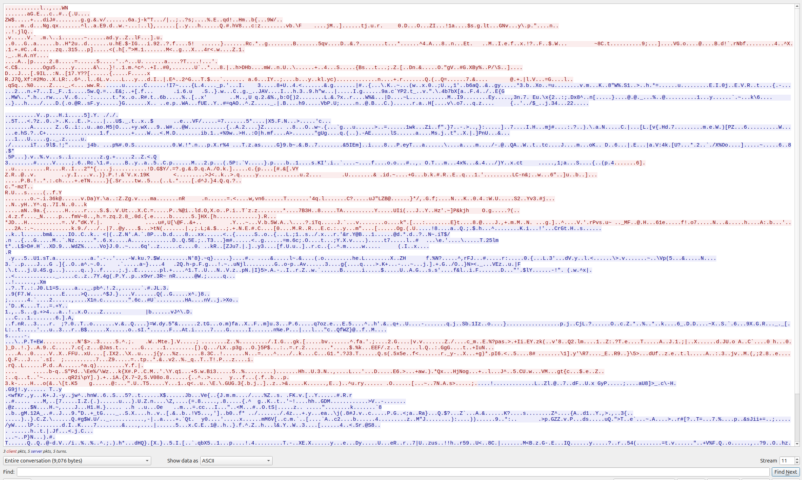

### Вопросы и ответы по безопасности информации

1. Какие виды инъекций вы знаете? 

- SQL-инъекция
- XSS (Cross-Site Scripting)
- RCE (Remote Code Execution)
- NoSQL-инъекции
- LDAP-инъекции
- CSS-инъекции
- HTML-инъекции
- XXE 
- CSV инъекции
- Log Injection
из новенького LLM-инъекция, которая может менять поведение модели так как хочет злоумышленник

2. Какие SQL-инъекции бывают, в чем смысл коротко?

SQL-инъекция (SQLi) на примере стенда, который я сделал

[SQL-инъекция (SQLi)](./stand_sql_injection/README.md)

- In-band SQLi (на основе объединения, на основе ошибок)
- Blind SQLi  
- Out-of-band SQLi 
- Second-order SQLi
- Инъекцию можно внедрить в любую часть HTTP-запроса, которая попадает в SQL-запрос без обработки
  1. GET-параметры
  2. POST-параметры
  3. HTTP-заголовки
- Authentication Bypass 
- Data Exfiltration
- Blind Data Manipulation
- RCE

1. Что такое XSS, какие виды и в чем смысл? 

- это уязвимость веб-безопасности, которая позволяет злоумышленнику внедрять вредоносный JavaScript-код в страницы, просматриваемые другими пользователями.
  
4. Что такое CORS? 

- CORS (Cross-Origin Resource Sharing) - это механизм безопасности, который позволяет веб-браузерам контролировать доступ к ресурсам на разных доменах. Он определяет, какие домены могут обращаться к ресурсам на сервере и какие HTTP-методы разрешены для этих запросов.

5. Что такое OAuth 2.0, как работает? 

- OAuth 2.0 - это протокол авторизации, который позволяет сторонним приложениям получать ограниченный доступ к ресурсам пользователя на другом сервисе без необходимости предоставлять свои учетные данные. Он работает через процесс получения токена доступа, который затем используется для доступа к защищенным ресурсам.

6. Происходит чтение из файла, в этот момент файл с которого идет чтение удаляется, что произойдет? 

- Если файл удаляется во время чтения, то результат будет зависеть от операционной системы и файловой системы. В большинстве случаев, если файл удаляется, то процесс чтения может продолжаться до тех пор, пока не будет достигнут конец файла. Однако, если файл удаляется до того, как процесс начнет чтение, то может возникнуть ошибка "File not found" или аналогичная ошибка, в зависимости от языка программирования и используемых библиотек.
 
7. Что означает «S» в HTTPS?

- Secure (Безопасный) - означает, что данные, передаваемые между вашим браузером и веб-сервером, шифруются с помощью протокола SSL/TLS. Это обеспечивает конфиденциальность и целостность данных, защищая их от перехвата и изменения злоумышленниками.

Так же эту историю можно посмотреть для примера на wireshark

Допустим по HTTP
Заходим на домашний маршрутизатор и так как это работает на HTTP видим всю информацию в открытом виде

что не скажешь при использовании TLS1.3

