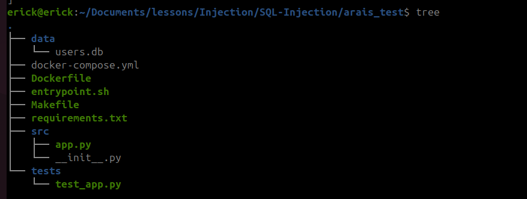

## Рассмотрим SQL-инъекция (SQLi)

Запустим тестовый стенд docker-compose и посмотрим как это работает

Образовательный стенд для демонстрации уязвимости SQL Injection (SQLi) на примере FastAPI приложения. Показывает механизм эксплуатации уязвимости и методы защиты.

Структура проекта



В терминале запустим:

```bash
cd ./arais_test
docker-compose up -d --build ## так как собираем контейнер из Dcokerfile
```

Проверяем работоспособность
```
curl http://localhost:8000/users/1
```

Если хотим отладить приложение
 
```
docker-compose logs --tail=30 app
```

Остановка стенда

```
docker-compose down -v
```

Теперь перейдем к описанию уязвимости

по команде

```
curl -s http://127.0.0.1:8000/users/admin | python3 -m json.tool
```
получаем

```
[
    {
        "id": 1,
        "username": "admin",
        "email": "admin@example.com",
        "role": "admin"
    }
]
```

Если же оправим

```
curl -s "http://127.0.0.1:8000/users/admin'%20OR%20'1'='1" | python3 -m json.tool
```

Получим ответ от всех пользователей из базы! 

```
[
    {
        "id": 1,
        "username": "admin",
        "email": "admin@example.com",
        "role": "admin"
    },
    {
        "id": 2,
        "username": "john",
        "email": "john@example.com",
        "role": "user"
    },
    {
        "id": 3,
        "username": "alice",
        "email": "alice@example.com",
        "role": "user"
    },
    {
        "id": 4,
        "username": "bob",
        "email": "bob@example.com",
        "role": "manager"
    }
]
```

Так как внитри запрос будет вынладеть вот так

```
SELECT * FROM users WHERE username = 'admin' OR '1'='1'
```

В данном случае выбираются все записи из таблицы (Authentication Bypass)

Как обезопасить, если возьмем и посмотрим код приложения, то увидим уязвимый код

```python
@app.get("/users/{username}")
def get_user(username: str):
    conn = sqlite3.connect(DB_PATH)
    cursor = conn.cursor()
    
    # УЯЗВИМОСТЬ: конкатенация строк
    query = f"SELECT * FROM users WHERE username = '{username}'"
    
    cursor.execute(query) 
    results = cursor.fetchall()
    conn.close()
    
    return results
```

чтобы обезопасить, лучше использовать

```
@app.get("/users_secure/{username}")
def get_user_secure(username: str):
    conn = sqlite3.connect(DB_PATH)
    cursor = conn.cursor()
    
    #  параметризованный запрос
    query = "SELECT * FROM users WHERE username = ?"
    
    cursor.execute(query, (username,))  # Данные передаются отдельно
    results = cursor.fetchall()
    conn.close()
    
    return results
```

Такой подход гарантирует, что пользовательский ввод не будет интерпретироваться как часть SQL-запроса, а будет обрабатываться как данные. Это предотвращает возможность выполнения вредоносного кода и защищает от SQL-инъекций.